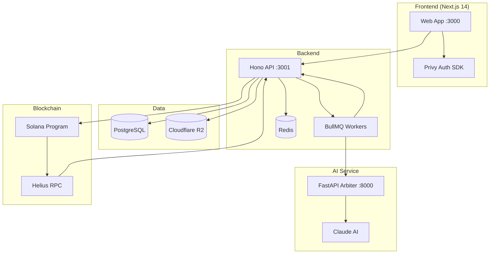
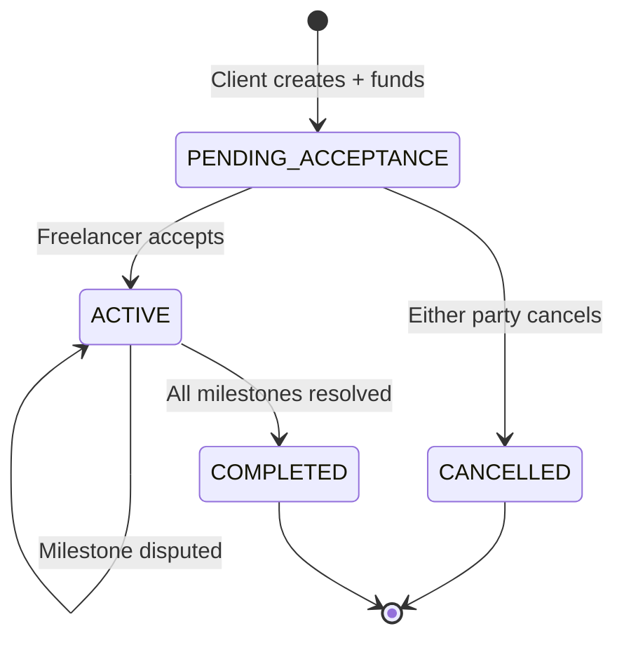
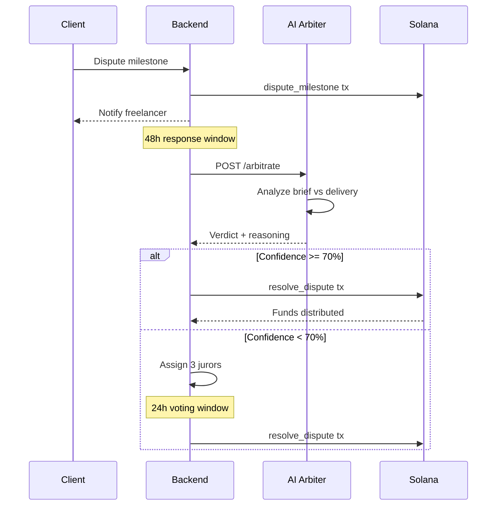

# Klyrn Architecture

## System Overview

## Data Flow: Contract Lifecycle

## Dispute Resolution Flow

## PDA Structure

| Account | Seeds | Authority |
|---------|-------|-----------|
| Contract | `["contract", contract_id]` | Program |
| Escrow Token | `["escrow", contract_pda]` | Contract PDA |
| Milestone | `["milestone", contract_pda, index]` | Program |
| ReputationStats | `["reputation", user_pubkey]` | Program |

## Key Design Decisions

1. **Separate AI service**: Python FastAPI for file processing (PDFs, images) and Claude integration. Different scaling profile than the Node.js API.

2. **BigInt everywhere**: Financial amounts never touch floating point. Cents in DB, USDC base units on-chain.

3. **Brief-as-ground-truth**: The contract brief markdown is hashed on-chain and used as the primary evidence for AI arbitration.

4. **Auto-approval timer**: Prevents clients from indefinitely blocking payments. Default 5 days, configurable per contract.

5. **Reputation on-chain**: cNFTs via Bubblegum make reputation portable across platforms.
